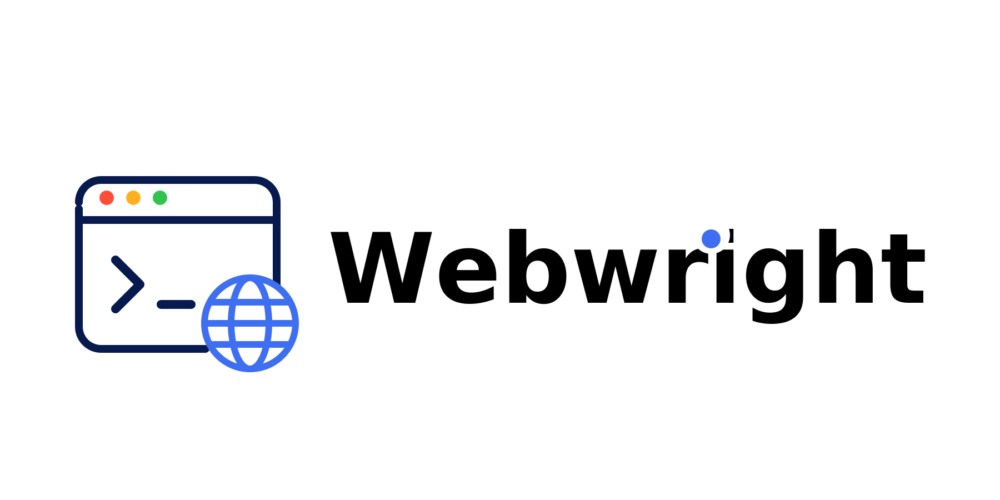

# Webwright: A Terminal Is All You Need for Web Agents

<p align="center">
  
</p>

<p align="center">
  <strong>A tiny, terminal-based web agent harness — readable end-to-end, SOTA on web agent benchmarks.</strong>
</p>

<p align="center">
  
  
  
  
</p>

- 📝 **Blog:** [Webwright: A terminal is all you need for web agents](https://www.microsoft.com/en-us/research/articles/webwright-a-terminal-is-all-you-need-for-web-agents/)
- 🌐 **Website & demo videos:** [microsoft.github.io/Webwright](https://microsoft.github.io/Webwright/)

Webwright gives agents a terminal where it can launch multiple browswer sessions to inspect the page and complete a web task. It captures and inspects page screenshots/states only when needed. It drives a Playwright browser through a minimal agent loop with pluggable LLM backends. No multi-agent system, no graph engine, no plugin layer, no hidden orchestration — just a terminal, a browser, and a model.

---

## 💡 Motivation: Beyond Step-by-Step Web Interaction in a Stateful Browser

Most web agents today treat the browser session itself as the workspace: at each step the model receives the current page state and predicts a single next operation — a click, a type, a DOM selector, or a short tool call. Whatever the format, the agent is locked into predicting one web action at a time inside a predefined interaction loop. That harness was useful when LLMs were weaker. As models get stronger at writing and debugging code, the same harness becomes a bottleneck.

Webwright takes a different stance: **separate the agent from the browser**, and treat the browser as something the agent can launch, inspect, and discard while developing a program. The persistent artifact is not the browser session — it's the **code and logs in the local workspace**.

- 🧱 **Robust, reusable interaction with web environments** — instead of fragile pixel-level actions, a coding agent with a terminal queries elements, waits for conditions, and handles dynamic behaviors like lazy loading or re-rendering. The resulting scripts can be rerun, adapted, and shared across tasks rather than rediscovered from scratch.
- ⚡ **Efficient composition of complex workflows** — multi-step interactions like selecting a date or filling a form become a compact program. Loops, functions, and abstractions let the agent generalize across similar tasks (e.g. different dates) without re-predicting the same low-level sequences. Fewer interaction rounds, faster execution, less error accumulation on long horizons.
- 🧪 **Workspace-as-state, not browser-as-state** — the agent can write exploratory scripts, spawn fresh browser sessions, and decide for itself when to capture screenshots and inspect failures, much like a human engineer iterating on an RPA script.
- 🪄 **Surprisingly effective despite being minimal** — this stripped-down setup turns out to handle complex and especially long-horizon web tasks well (see [Performance](#-performance)).

---

## 🌟 Why Webwright

Most web agent frameworks bury the actual agent loop under layers of abstractions. Webwright takes the opposite stance:

- 🪶 **Lightweight by design** — core agent loop in a single ~450-line file, Playwright environment in ~570 lines, CLI in ~150 lines.
- 🧩 **Pluggable model backends** — OpenAI, Anthropic, and OpenRouter, each ~150–200 lines.
- 🔍 **Zero hidden frameworks** — just `httpx`, `pydantic`, `playwright`, and `typer`.
- 🔁 **Flat prompt → observe → act loop** — readable end-to-end, easy to debug, easy to fork.
- 🧪 **Run-artifact first** — every run writes trajectories and screenshots to disk for inspection.

If you want a minimal, easy-to-debug starting point for browser-using agents instead of another heavyweight platform, this is it.

---

## 📊 Performance

State-of-the-art on two real-website benchmarks with a 100-step budget — see the [blog post](https://www.microsoft.com/en-us/research/articles/webwright-a-terminal-is-all-you-need-for-web-agents/) for full details.

- 🏆 **Online-Mind2Web (300 tasks):** **86.7%** with GPT-5.4 — highest among open-sourced harnesses in the AutoEval category. Claude Opus 4.7 reaches **84.7%**, and is stronger on the hard split (**80.5%** vs. 76.6% for GPT-5.4 at N=100).
- 🚀 **Odysseys (200 long-horizon tasks):** **60.1%** with GPT-5.4 (avg. 76.1 steps) — **+15.6 points** over the prior SOTA (Opus 4.6 at 44.5%, using xy-coordinate prediction and persistent browser) and **+26.6 points** over base GPT-5.4 (33.5% using xy-coordinate prediction and persistent browser).
- 🧠 **Code-as-action beats coordinate prediction:** Webwright substantially outperforms a reproduced GPT-5.4 screenshot+xy-coordinate baseline across all difficulty splits.
- 🧰 **Small models + reusable tools:** generated scripts can be packaged as parameterized CLI tools — even **Qwen-3.5-9B** completes tasks well on Online-Mind2Web sites with 5+ tools available.

---

## �🗺️ Project Map

```
webwright/
├── pyproject.toml           # package: webwright
├── src/webwright/
│   ├── run/cli.py           # CLI entrypoint (`webwright`)
│   ├── agents/default.py    # core agent loop
│   ├── environments/        # Playwright browser workspace
│   ├── tools/               # image_qa, self_reflection
│   ├── models/              # openai_model, anthropic_model, base
│   ├── config/              # base.yaml, model_openai.yaml, model_claude.yaml
│   └── utils/
├── tests/
└── outputs/                 # run artifacts (trajectories, screenshots)
```

---

## 🚀 Quick Start

### Prerequisites

- Python 3.10+
- Chromium installed through Playwright
- An API key for your chosen backend (OpenAI, Anthropic, or OpenRouter)

### Install

```bash
pip install -e .
playwright install chromium
```

### Run

Export credentials for the chosen backend (e.g. `OPENAI_API_KEY` or `ANTHROPIC_API_KEY`), then:

```bash
python -m webwright.run.cli \
    -c base.yaml -c model_openai.yaml \
    -t "Find the cheapest economy flight from SEA to JFK on 2026-05-15" \
    --start-url https://www.google.com/flights \
    --task-id demo_openai \
    -o outputs/default
```

### 🚩 Flags

| Flag | Description |
|------|-------------|
| `-c` | Config file(s) from `src/webwright/config/` (stackable). |
| `-t` | Task instruction. |
| `--start-url` | Initial page. |
| `--task-id` | Output subfolder name. |
| `-o` | Output directory. |

---

## 🤖 Use as a Claude Code Skill

Webwright ships a [Claude Code](https://docs.claude.com/en/docs/claude-code/overview) skill at [`skills/webwright/`](skills/webwright/) that lets Claude Code itself drive the Webwright loop — no extra LLM API key or cost beyond your Claude Code subscription. Claude reads PNG screenshots natively, so the OpenAI-backed `image_qa` and `self_reflection` tools are not used.

### Install

Run these commands from the Webwright repo root to copy (or symlink) the skill into one of Claude Code's skill directories, plus the matching slash-command templates:

```bash
# Project-scoped (only available when Claude Code is opened inside this repo):
mkdir -p .claude/skills .claude/commands
ln -s "$PWD/skills/webwright"          .claude/skills/webwright
ln -s "$PWD/skills/webwright/commands" .claude/commands/webwright

# Or user-scoped (available in every project):
mkdir -p ~/.claude/skills ~/.claude/commands
ln -s "$PWD/skills/webwright"          ~/.claude/skills/webwright
ln -s "$PWD/skills/webwright/commands" ~/.claude/commands/webwright
```

Then install Webwright's runtime dependencies once:

```bash
pip install -e .
playwright install chromium
```

### Use

**Start a new Claude Code session** after installing — skills are loaded at session start and won't appear until you restart.

- Project-scoped install: open Claude Code from inside this repo.
- User-scoped install: open Claude Code in any directory.

You can either ask Claude Code in plain English (the skill auto-activates from its description), or use one of the slash commands:

```
/webwright:run search Google Flights for the cheapest economy flight from SEA to JFK on 2026-05-15
/webwright:craft search a ticket on Google Flights from LAX to SFO depart June 7 return June 14
```

- `/webwright:run` (or any plain prompt) produces a **one-shot** `final_script.py` for the literal task values.
- `/webwright:craft` produces a **reusable CLI tool**: `final_script.py` becomes one parameterized function with a Google-style `Args:` docstring and an `argparse` wrapper whose flags default to the concrete task values, so you can rerun it later with different arguments — e.g. `python final_script.py --origin JFK --destination LAX --depart-date 2026-07-01`.

In both modes Claude Code scaffolds a workspace with `plan.md`, runs instrumented Playwright scripts under `final_runs/run_<id>/`, and visually self-verifies each critical point against the saved screenshots.

---

## ♿ Give Back to the Accessibility Community

Web-agent research is now benefiting from infrastructure originally designed for accessibility. Accessibility trees, ARIA metadata, and semantic page representations help assistive technologies expose web content to people with disabilities; today, the same signals also give LLM agents a machine-readable view of pages beyond pixels.

As builders, we have a responsibility to bring these advances back to the accessibility community. Webwright could support everyday assistive workflows such as:

- 📝 forms and appointments
- 🚌 transportation lookups
- 🛒 service and price comparison

…while also acting as a repair layer for the web itself: inspecting pages, detecting missing labels, confusing controls, broken navigation, or inaccessible forms, and generating reusable scripts or overlays that make sites easier to understand and operate.

We encourage developers to propose ideas for using Webwright to move us closer to a more accessible and useful web for everyone.

---

## Credits

- [SWE-agent/mini-swe-agent](https://github.com/SWE-agent/mini-swe-agent/tree/main) — design inspiration for the minimal agent loop.
- [Playwright](https://playwright.dev/) — browser automation.

## Citation

If you use Webwright in your research or build on it, please cite this repository:

```bibtex
@misc{webwright2026,
  title        = {Webwright: A terminal is all you need for web agents},
  author       = {Lu, Yadong and Xu, Lingrui and Huang, Chao and Awadallah, Ahmed},
  year         = {2026},
  howpublished = {\url{https://github.com/microsoft/Webwright}},
  note         = {GitHub repository}
}
```